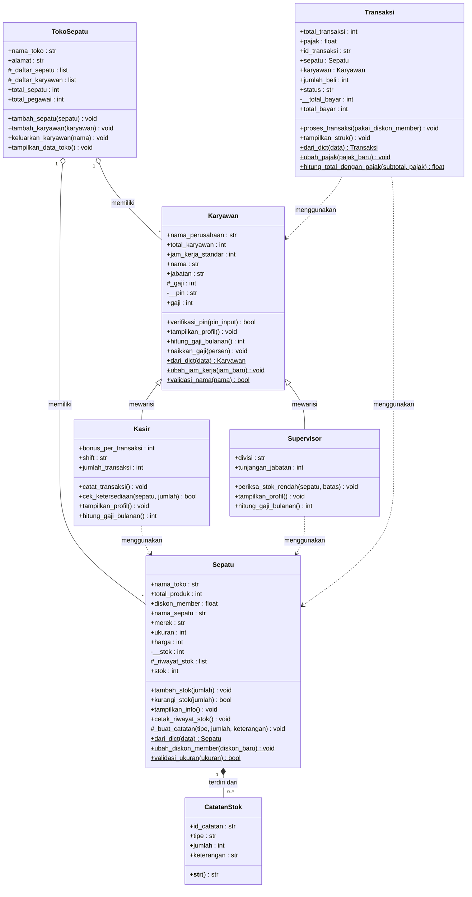

# Sistem Pengelolaan Penjualan dan Stok pada Toko Sepatu

Program ini mensimulasikan pengelolaan produk sepatu, karyawan, dan transaksi penjualan di sebuah toko sepatu. Posttest ini melanjutkan program sebelumnya dengan menambahkan **Relasi UML** (asosiasi, agregasi, komposisi) dan **Inheritance** (superclass, subclass, `super()`, method overriding, atribut protected dan private).

## 1. Deskripsi Program

Program mengelola tiga hal utama:

- **Produk (Sepatu)**: data sepatu, stok, serta riwayat perubahan stok.
- **Karyawan**: kasir dan supervisor beserta gajinya.
- **Transaksi**: penjualan sepatu yang mengurangi stok, menghitung diskon member dan pajak, lalu mencetak struk.

Satu class tambahan, `TokoSepatu`, dipakai untuk menampung sepatu dan karyawan yang dimiliki toko.

---

## 2. Daftar Class

| Class | Peran | Keterangan |
|---|---|---|
| `CatatanStok` | Bagian dari `Sepatu` | Satu baris riwayat stok (MASUK/KELUAR) |
| `Sepatu` | Class utama produk | Data sepatu, stok private, riwayat stok |
| `Karyawan` | **Superclass** | Atribut dan method umum semua karyawan |
| `Kasir` | **Subclass** dari `Karyawan` | Menambah `shift`, `jumlah_transaksi` |
| `Supervisor` | **Subclass** dari `Karyawan` | Menambah `divisi`, `tunjangan_jabatan` |
| `TokoSepatu` | Penampung (agregasi) | Menampung daftar sepatu dan karyawan |
| `Transaksi` | Proses penjualan | Menghubungkan sepatu dan karyawan, menghitung total bayar |

---

## 3. Diagram UML



---

## 4. Penerapan Relasi UML

### 4.1 Asosiasi ("menggunakan")

Objek lain hanya dipakai sesaat. Objek tersebut dibuat di luar dan dikirim lewat parameter method, tidak disimpan sebagai atribut tetap.

| Class asal | Method | Objek yang digunakan |
|---|---|---|
| `Kasir` | `cek_ketersediaan(sepatu, jumlah)` | `Sepatu` |
| `Supervisor` | `periksa_stok_rendah(sepatu, batas)` | `Sepatu` |
| `Transaksi` | `__init__(id, sepatu, karyawan, jumlah)` | `Sepatu`, `Karyawan` |

```python
class Kasir(Karyawan):
    def cek_ketersediaan(self, sepatu, jumlah):
        cukup = sepatu.stok >= jumlah
        ...
```

### 4.2 Agregasi ("memiliki")

`TokoSepatu` menampung objek `Sepatu` dan `Karyawan` yang **dibuat di luar** lalu didaftarkan ke dalam list. Jika toko dihapus, sepatu dan karyawan **tetap ada**.

```python
class TokoSepatu:
    def __init__(self, nama_toko, alamat):
        self._daftar_sepatu = []
        self._daftar_karyawan = []

    def tambah_sepatu(self, sepatu):
        if isinstance(sepatu, Sepatu):
            self._daftar_sepatu.append(sepatu)
```

Buktinya ada di main program: setelah `del toko`, `sepatu1` dan `kasir1` masih bisa dipakai.

### 4.3 Komposisi ("terdiri dari")

`Sepatu` terdiri dari `CatatanStok`. Objek `CatatanStok` **dibuat langsung di dalam** `Sepatu` lewat `_buat_catatan()`, tidak pernah dibuat dari luar, dan ikut musnah bersama `Sepatu`-nya.

```python
class Sepatu:
    def _buat_catatan(self, tipe, jumlah, keterangan):
        id_baru = f"STK-{len(self._riwayat_stok) + 1:03d}"
        self._riwayat_stok.append(CatatanStok(id_baru, tipe, jumlah, keterangan))
```

Method `tambah_stok()` dan `kurangi_stok()` otomatis membuat catatan baru setiap stok berubah.

### Ringkasan

| Aspek | Asosiasi | Agregasi | Komposisi |
|---|---|---|---|
| Contoh di program | `Kasir` ..> `Sepatu` | `TokoSepatu` o-- `Sepatu` | `Sepatu` *-- `CatatanStok` |
| Objek bagian dibuat | Di luar, lewat parameter | Di luar, dikirim ke penampung | Di dalam objek induk |
| Jika induk dihapus | Objek yang dipakai tetap ada | Anggota tetap ada | Objek bagian ikut musnah |

---

## 5. Penerapan Inheritance

### 5.1 Superclass dan Subclass

```
Karyawan  (superclass)
├── Kasir        (subclass)
└── Supervisor   (subclass)
```

Uji relasi *is-a*: Kasir adalah Karyawan (benar), Supervisor adalah Karyawan (benar).

### 5.2 Penggunaan `super().__init__(...)`

Kedua subclass memanggil konstruktor superclass untuk mengisi atribut bawaan, lalu menambah atribut miliknya sendiri.

```python
class Kasir(Karyawan):
    def __init__(self, nama, gaji, shift="Pagi", pin="0000"):
        super().__init__(nama, "Kasir", gaji, pin)
        self.shift = shift
        self.jumlah_transaksi = 0
```

### 5.3 Atribut Tambahan (Spesifik Subclass)

| Subclass | Atribut unik |
|---|---|
| `Kasir` | `shift`, `jumlah_transaksi`, atribut kelas `bonus_per_transaksi` |
| `Supervisor` | `divisi`, `tunjangan_jabatan` |

### 5.4 Method Overriding

| Method di `Karyawan` | Override di `Kasir` | Override di `Supervisor` |
|---|---|---|
| `tampilkan_profil()` | Menambah info shift dan jumlah transaksi | Menambah info divisi dan tunjangan |
| `hitung_gaji_bulanan()` | `_gaji` + (`jumlah_transaksi` × bonus) | `_gaji` + `tunjangan_jabatan` |

Selain itu, `dari_dict()` juga di-override di kedua subclass karena parameter konstruktornya berbeda dari `Karyawan`.

```python
class Supervisor(Karyawan):
    def hitung_gaji_bulanan(self):
        return self._gaji + self.tunjangan_jabatan
```

### 5.5 Tingkat Akses pada Pewarisan

| Atribut | Level | Alasan |
|---|---|---|
| `_gaji` | **Protected** | Perlu dipakai langsung oleh subclass untuk menghitung gaji bulanan |
| `__pin` | **Private** | Rahasia, eksklusif milik `Karyawan`; hanya bisa diperiksa lewat `verifikasi_pin()` |

Jika subclass mencoba mengakses `self.__pin`, Python menghasilkan `AttributeError` karena *name mangling*. Hal ini didemonstrasikan di bagian 10 main program.

---

## 6. Konsep Modul Sebelumnya yang Tetap Dipakai

| Modul | Konsep | Contoh di program |
|---|---|---|
| 1 | Class, object, constructor, `self` | Semua class |
| 2 | Atribut instance dan kelas | `nama_sepatu` vs `Sepatu.total_produk` |
| 2 | Instance, class, static method | `tambah_stok()`, `dari_dict()`, `validasi_ukuran()` |
| 3 | Encapsulation, `@property`, setter dengan validasi | `stok`, `gaji`, `total_bayar` |

---

## 7. Cara Menjalankan

Kebutuhan: Python 3.8 atau lebih baru (tanpa library tambahan).

```bash
python toko_sepatu.py
```

---

## 8. Contoh Output

Potongan output program (bagian yang menunjukkan relasi dan inheritance):

```text
--- 2. Membuat Objek Karyawan (Subclass) ---
Nama: Dimas | Jabatan: Kasir | Perusahaan: Toko Sepatu Otep
   -> Shift: Pagi | Transaksi ditangani: 0
Nama: Rina | Jabatan: Supervisor | Perusahaan: Toko Sepatu Otep
   -> Divisi: Operasional | Tunjangan: Rp1,000,000
isinstance(kasir1, Karyawan)      : True
issubclass(Supervisor, Karyawan)  : True

--- 6. Relasi ASOSIASI (Kasir/Supervisor ..> Sepatu) ---
Kasir Dimas mengecek 'Air Runner' x2: TERSEDIA (stok 25)
Kasir Dimas mengecek 'UltraBoost' x100: TIDAK CUKUP (stok 15)
Supervisor Rina: stok 'Air Runner' menipis (25), segera restock!
Supervisor Rina: stok 'UltraBoost' aman (15).

--- 8. Relasi KOMPOSISI (Sepatu *-- CatatanStok) ---
Riwayat stok Air Runner:
  [STK-001] MASUK  +20 | Ket: Stok awal produk
  [STK-002] MASUK  +5 | Ket: Restock dari supplier
  [STK-003] KELUAR -2 | Ket: Penjualan

--- 9. Relasi AGREGASI (TokoSepatu o-- Sepatu & Karyawan) ---
  [+] Dimas (Kasir) mulai bekerja di Toko Sepatu Otep
  ...
Toko dibubarkan (del toko) ...
Objek tetap ada di memori setelah toko dihapus:
[Nike] Air Runner | Ukuran: 42 | Harga: Rp850,000 | Stok: 23

--- 10. Method Overriding & Tingkat Akses ---
Gaji pokok Dimas (Kasir)      : Rp3,850,000
Gaji bulanan Dimas (+bonus)   : Rp3,860,000
Gaji pokok Rina (Supervisor)  : Rp5,000,000
Gaji bulanan Rina (+tunjangan): Rp6,000,000
PIN Dimas benar (1234)? : True
PIN Dimas benar (0000)? : False
Akses __pin ditolak (private): 'Kasir' object has no attribute '__pin'
```