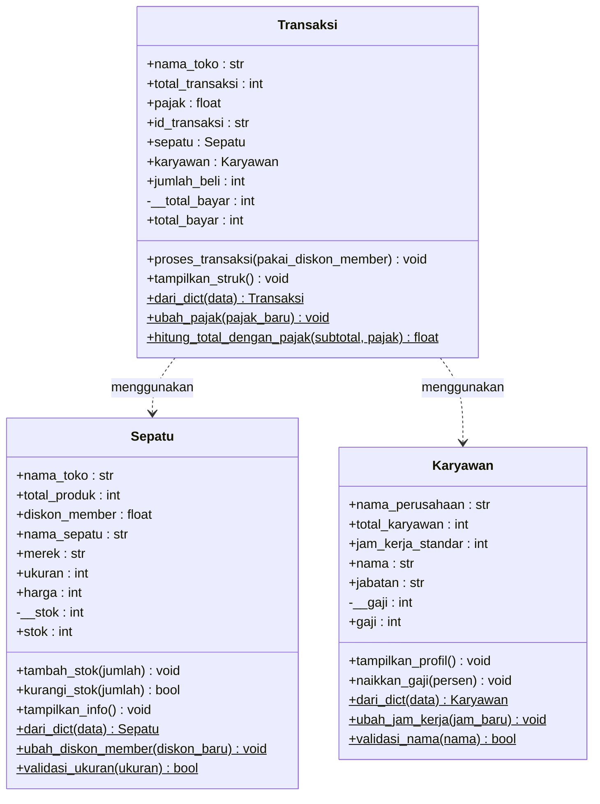

# Sistem Pengelolaan Penjualan dan Stok pada Toko Sepatu

Program ini mensimulasikan pengelolaan produk sepatu, data karyawan, dan transaksi penjualan pada sebuah toko sepatu. Program menerapkan konsep **Class dan Object**, **Atribut dan Method** (instance, class, static), serta **Encapsulation** (atribut private dengan `@property`, getter, dan setter).

## 1. Deskripsi Program

Program terdiri dari tiga class yang saling bekerja sama:

- **`Sepatu`** mengelola data produk beserta stoknya.
- **`Karyawan`** mengelola data karyawan atau kasir toko.
- **`Transaksi`** menghubungkan objek `Sepatu` dan `Karyawan` untuk memproses penjualan: mengurangi stok, menghitung diskon member dan pajak, lalu mencetak struk.

---

## 2. Struktur Class

| Class | Fungsi | Atribut Instance | Atribut Private | Atribut Kelas |
|---|---|---|---|---|
| `Sepatu` | Data produk dan stok | `nama_sepatu`, `merek`, `ukuran`, `harga` | `__stok` | `nama_toko`, `total_produk`, `diskon_member` |
| `Karyawan` | Data karyawan | `nama`, `jabatan` | `__gaji` | `nama_perusahaan`, `total_karyawan`, `jam_kerja_standar` |
| `Transaksi` | Proses penjualan | `id_transaksi`, `sepatu`, `karyawan`, `jumlah_beli` | `__total_bayar` | `nama_toko`, `total_transaksi`, `pajak` |

---

## 3. Diagram Class



Pada program ini `Transaksi` tidak membuat objek `Sepatu` maupun `Karyawan` sendiri. Keduanya dibuat di luar lalu diterima lewat constructor, sehingga hubungannya berupa asosiasi (panah putus-putus). Ketiga class berdiri sendiri dan tidak ada pewarisan.

---

## 4. Penjelasan Tiap Class

### 4.1 Class `Sepatu`

Menyimpan informasi produk. Stok dibuat **private** (`__stok`) agar tidak bisa diubah sembarangan dari luar.

| Method | Jenis | Fungsi |
|---|---|---|
| `stok` (getter) | Property | Membaca nilai stok private |
| `stok` (setter) | Property | Mengubah stok, menolak nilai negatif dengan `ValueError` |
| `tambah_stok(jumlah)` | Instance method | Menambah stok (restock), lewat setter agar tervalidasi |
| `kurangi_stok(jumlah)` | Instance method | Mengurangi stok saat penjualan, mengembalikan `True` atau `False` |
| `tampilkan_info()` | Instance method | Mencetak informasi lengkap produk |
| `dari_dict(data)` | Class method | Factory method: membuat `Sepatu` dari dictionary |
| `ubah_diskon_member(diskon_baru)` | Class method | Mengubah atribut kelas `diskon_member` (valid 0 sampai 1) |
| `validasi_ukuran(ukuran)` | Static method | Mengecek ukuran berada pada rentang 30 sampai 46 |

### 4.2 Class `Karyawan`

Menyimpan data karyawan. Gaji dibuat **private** (`__gaji`) dengan validasi tidak boleh negatif.

| Method | Jenis | Fungsi |
|---|---|---|
| `gaji` (getter/setter) | Property | Membaca dan mengubah gaji dengan validasi |
| `tampilkan_profil()` | Instance method | Mencetak profil karyawan |
| `naikkan_gaji(persen)` | Instance method | Menaikkan gaji berdasarkan persentase |
| `dari_dict(data)` | Class method | Factory method: membuat `Karyawan` dari dictionary |
| `ubah_jam_kerja(jam_baru)` | Class method | Mengubah `jam_kerja_standar` untuk semua karyawan |
| `validasi_nama(nama)` | Static method | Memastikan nama berupa string dan tidak kosong |

### 4.3 Class `Transaksi`

Menghubungkan produk dan karyawan dalam satu proses penjualan. Total bayar dibuat **private** (`__total_bayar`).

| Method | Jenis | Fungsi |
|---|---|---|
| `total_bayar` (getter/setter) | Property | Membaca dan mengubah total bayar dengan validasi |
| `proses_transaksi(pakai_diskon_member)` | Instance method | Mengurangi stok, menghitung diskon dan pajak, menyimpan total bayar |
| `tampilkan_struk()` | Instance method | Mencetak struk pembelian |
| `dari_dict(data)` | Class method | Factory method: membuat `Transaksi` dari dictionary |
| `ubah_pajak(pajak_baru)` | Class method | Mengubah atribut kelas `pajak` (valid 0 sampai 1) |
| `hitung_total_dengan_pajak(subtotal, pajak)` | Static method | Fungsi bantu: `subtotal + subtotal * pajak` |

Rumus perhitungan total bayar:

```
subtotal = harga × jumlah_beli
subtotal = subtotal − (subtotal × diskon_member)     # jika pakai diskon member
total    = subtotal + (subtotal × pajak)
```

---

## 5. Penerapan Konsep Modul

### 5.1 Class dan Object (Modul 1)

Setiap class punya constructor `__init__()` dan memakai `self`. Objek dibuat lewat instansiasi:

```python
sepatu1 = Sepatu("Air Runner", "Nike", 42, 850000, 20)
karyawan1 = Karyawan("Dimas", "Kasir", 3500000)
```

### 5.2 Atribut Instance dan Atribut Kelas (Modul 2)

- **Atribut instance** berbeda tiap objek, ditulis di `__init__` dengan `self` (contoh: `nama_sepatu`, `harga`).
- **Atribut kelas** dibagi ke semua objek dan diubah lewat nama kelas (contoh: `Sepatu.diskon_member`).
- Atribut kelas juga dipakai sebagai penghitung otomatis: `Sepatu.total_produk += 1` di constructor.

### 5.3 Tiga Jenis Method (Modul 2)

| Jenis | Parameter pertama | Contoh di program |
|---|---|---|
| Instance method | `self` | `tambah_stok()`, `naikkan_gaji()`, `proses_transaksi()` |
| Class method | `cls` | `dari_dict()`, `ubah_diskon_member()`, `ubah_pajak()` |
| Static method | tidak ada | `validasi_ukuran()`, `validasi_nama()`, `hitung_total_dengan_pajak()` |

### 5.4 Encapsulation (Modul 3)

Data sensitif dibuat private dengan awalan dua garis bawah, lalu diakses lewat `@property`:

```python
self.__stok = stok

@property
def stok(self):
    return self.__stok

@stok.setter
def stok(self, nilai_baru):
    if nilai_baru < 0:
        raise ValueError("Stok tidak boleh bernilai negatif!")
    self.__stok = nilai_baru
```

| Class | Atribut private | Aturan validasi |
|---|---|---|
| `Sepatu` | `__stok` | Tidak boleh negatif |
| `Karyawan` | `__gaji` | Tidak boleh negatif |
| `Transaksi` | `__total_bayar` | Tidak boleh negatif |

---

## 6. Alur Program Utama

Bagian `if __name__ == "__main__":` menjalankan pengujian secara berurutan:

1. Membuat objek `Sepatu` (langsung dan lewat `dari_dict`).
2. Membuat objek `Karyawan` (langsung dan lewat `dari_dict`).
3. Menguji instance method: `tambah_stok(5)` dan `naikkan_gaji(10)`.
4. Menguji static method: validasi ukuran dan nama.
5. Menguji class method: mengubah diskon member menjadi 15% dan jam kerja menjadi 9 jam.
6. Membuat dan memproses dua transaksi, lalu mencetak struk.
7. Menguji setter dengan data valid dan tidak valid (`ValueError` ditangkap dengan `try/except`).

---

## 7. Cara Menjalankan

Kebutuhan: Python 3.8 atau lebih baru (tanpa library tambahan).

```bash
python nama_file.py
```

Ganti `nama_file.py` dengan nama file kode program.

---

## 8. Contoh Output

```text
--- 1. Membuat Objek Sepatu ---
[Nike] Air Runner | Ukuran: 42 | Harga: Rp850,000 | Stok: 20
[Adidas] UltraBoost | Ukuran: 40 | Harga: Rp1,200,000 | Stok: 15
Total produk terdaftar (atribut kelas): 2

--- 2. Membuat Objek Karyawan ---
Nama: Dimas | Jabatan: Kasir | Perusahaan: Toko Sepatu Otep
Nama: Rina | Jabatan: Supervisor | Perusahaan: Toko Sepatu Otep
Total karyawan terdaftar (atribut kelas): 2

--- 3. Uji Instance Method ---
Stok 'Air Runner' bertambah 5. Stok sekarang: 25
Gaji Dimas naik 10% menjadi Rp3,850,000

--- 4. Uji Static Method ---
Validasi ukuran 42        : True
Validasi ukuran 60        : False
Validasi nama 'Dimas'     : True
Validasi nama '' (kosong) : False

--- 5. Uji Class Method ---
Diskon member berhasil diubah menjadi 15%
Jam kerja standar diubah menjadi 9 jam/hari

--- 6. Membuat & Memproses Transaksi ---
Transaksi TRX001 berhasil diproses oleh Dimas.

========== STRUK PEMBELIAN ==========
Toko        : Toko Sepatu Otep
ID Transaksi: TRX001
Kasir       : Dimas
Produk      : Air Runner (Nike)
Jumlah      : 2
Total Bayar : Rp1,603,950
======================================

Transaksi TRX002 berhasil diproses oleh Rina.

========== STRUK PEMBELIAN ==========
Toko        : Toko Sepatu Otep
ID Transaksi: TRX002
Kasir       : Rina
Produk      : UltraBoost (Adidas)
Jumlah      : 3
Total Bayar : Rp3,996,000
======================================

Total transaksi tercatat (atribut kelas): 2

--- 7. Uji Setter & Validasi Data ---
Stok sepatu2 sebelum diubah : 12
Stok sepatu2 setelah diubah (valid) : 50
Gagal mengubah stok (tidak valid) : Stok tidak boleh bernilai negatif!

Gaji karyawan2 sebelum diubah : 5000000
Gaji karyawan2 setelah diubah (valid) : 5500000
Gagal mengubah gaji (tidak valid) : Gaji tidak boleh bernilai negatif!

Total bayar transaksi1 saat ini : 1603950.0
Gagal mengubah total bayar (tidak valid) : Total bayar tidak boleh bernilai negatif!
```

Perhitungan TRX001: 2 × Rp850.000 = Rp1.700.000, dikurangi diskon member 15% menjadi Rp1.445.000, ditambah pajak 11% menjadi **Rp1.603.950**.